# InterpolationGeneration
A stupidly simple "generative model" tested on standard univariate distributions and the MNIST dataset.

#### Method
Estimate the empirical distribution of the training set. Generate a uniform random variable _u_ between 0 and 1. Find the value at the _u_'th percentile of the training set, linearly interpolating when the desired quantile lies between two data points. That's it!

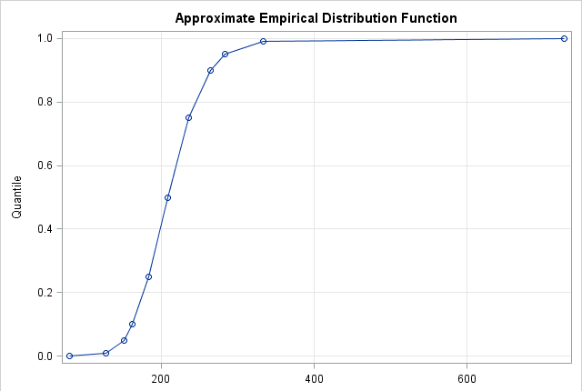

## Results
### Gaussian
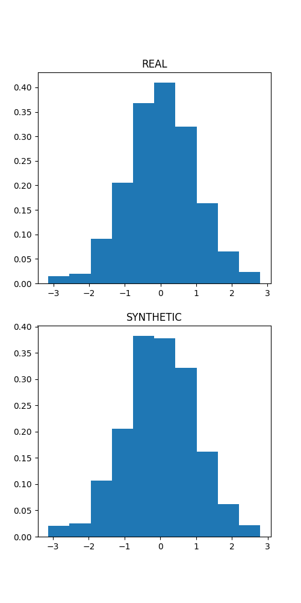

### Exponential
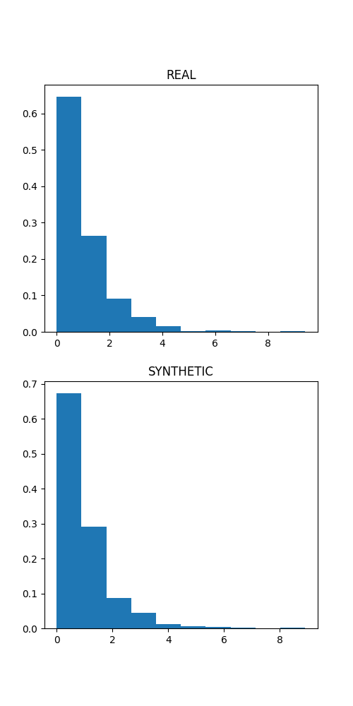

### MNIST
For each of the 784 pixels in an MNIST image, consider the ECDF of the distribution of that pixel's values across all images in the training set with the same label. Sample a new value from this distribution using the method described above. Note that this strategy does not incorporate the prior knowledge that pixels near each other should be related to one another. This method is stupid!

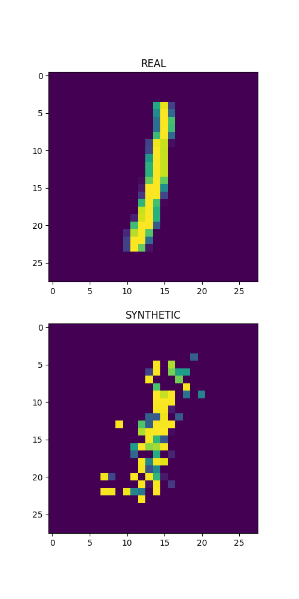
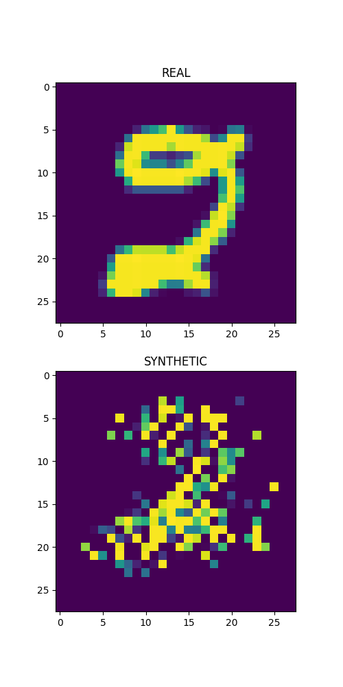
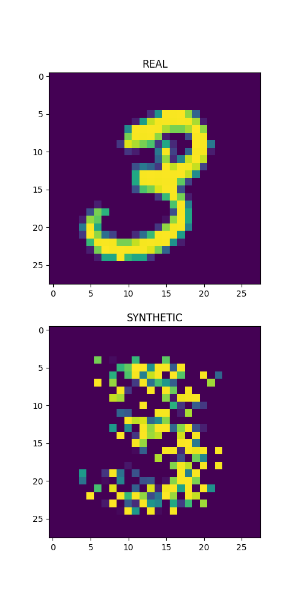
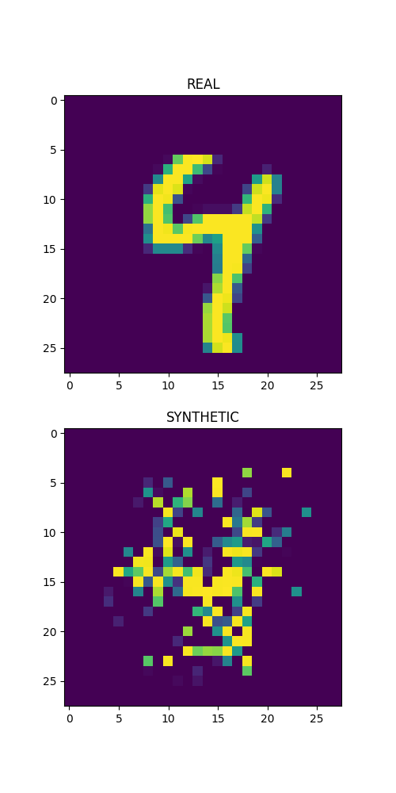
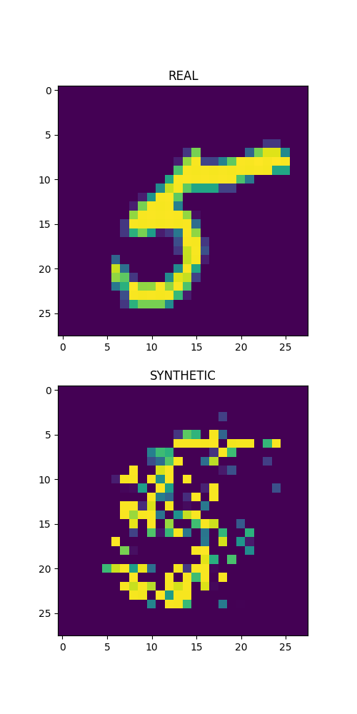
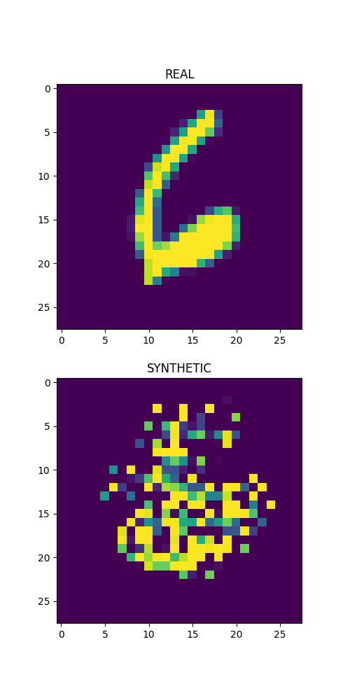
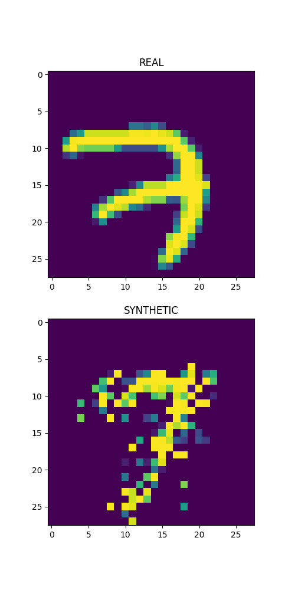
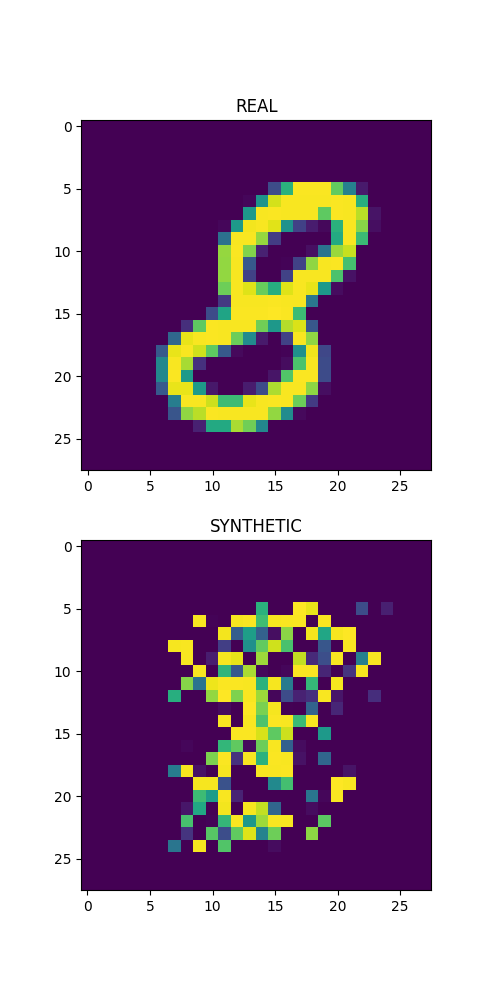
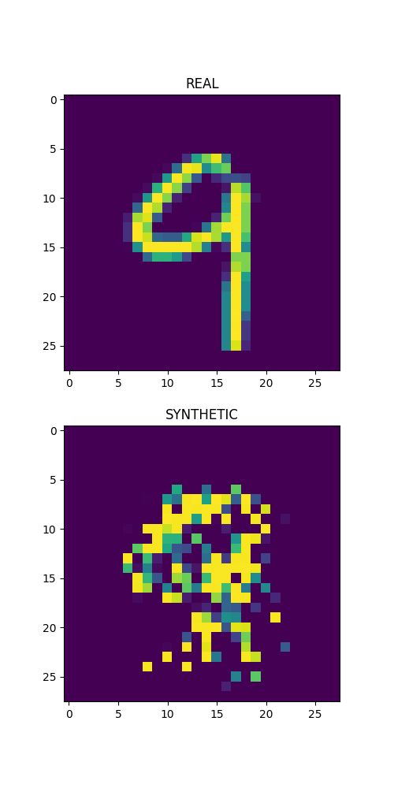
